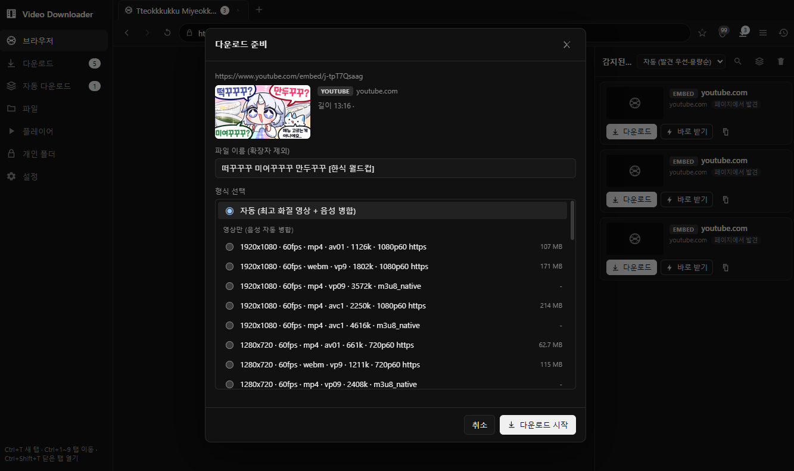
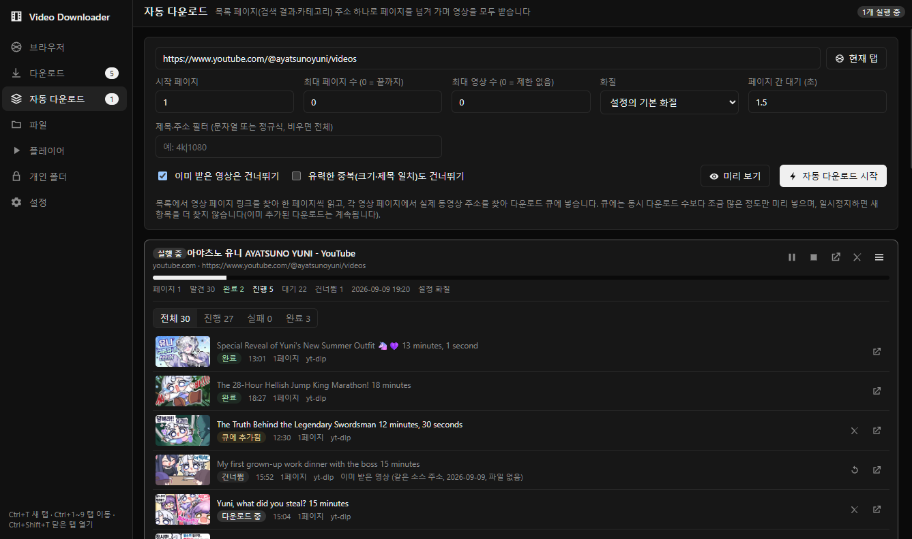

# Auto Video Downloader

웹 페이지의 동영상을 찾아서 내려받는 PC 프로그램입니다.
내장 브라우저로 사이트를 열면 영상을 자동으로 감지하고, 화질을 골라 저장할 수 있습니다.
유튜브 채널이나 검색 결과처럼 영상이 여러 개 있는 페이지는 주소 하나만 넣으면 전부 받아 줍니다.

## 다운로드

[Releases](https://github.com/i-still-love-you/auto-video-downloader/releases) 에서 최신 `Auto Video Downloader-x.x.x-setup.exe` 를 받아 설치하세요. (Windows 10 이상)

처음 실행하면 **설정 > 도구** 에서 yt-dlp 와 ffmpeg 를 버튼 한 번으로 설치할 수 있습니다.
유튜브 같은 사이트를 분석하고 잘게 쪼개진 영상(HLS)을 하나로 합치는 데 필요합니다.

## 사용법

### 영상 하나 받기



1. **브라우저** 탭에서 영상이 있는 페이지를 엽니다.
2. 오른쪽 **감지된 영상** 목록에 영상이 나타나면 **다운로드** 를 누릅니다.
3. 파일 이름과 화질을 고르고 **다운로드 시작** 을 누릅니다.

**바로 받기** 를 누르면 화질을 고르지 않고 설정해 둔 기본 화질로 즉시 받습니다.

### 여러 영상 한 번에 받기 (자동 다운로드)



1. **자동 다운로드** 탭에서 목록 페이지 주소(유튜브 채널, 검색 결과, 카테고리 등)를 넣습니다.
   브라우저에서 보고 있는 페이지라면 **현재 탭** 버튼으로 바로 넣을 수 있습니다.
2. 필요하면 최대 영상 수, 화질, 제목 필터를 정합니다. **미리 보기** 로 어떤 영상이 잡히는지 먼저 확인할 수 있습니다.
3. **자동 다운로드 시작** 을 누르면 페이지를 넘겨 가며 영상을 순서대로 받습니다. 이미 받은 영상은 건너뜁니다.

앱을 껐다 켜도 하던 작업을 이어서 할 수 있습니다.

## 주요 기능

- **자동 감지**: 페이지에서 재생되는 영상(MP4, HLS 등)을 자동으로 찾아 목록에 보여 줍니다.
- **화질 선택**: 해상도, 형식, 용량을 보고 고르거나 기본 화질로 자동 선택합니다.
- **이어받기와 중복 방지**: 끊긴 다운로드는 이어서 받고, 이미 받은 영상은 알려 줍니다.
- **광고·팝업 차단**: 내장 브라우저에 광고 차단과 팝업 차단이 들어 있습니다.
- **내장 플레이어**: 받기 전 미리 보기, 받은 파일 재생, 배속·회전·반복 재생.
- **파일 관리**: 받은 파일을 썸네일로 보고 이름 변경과 삭제를 할 수 있습니다.
- **개인 폴더**: PIN 으로 잠그는 암호화 폴더에 영상을 따로 보관합니다.

## 개발자용

Electron + TypeScript + React 로 만들었습니다. Node.js 20 이상이 필요합니다.

```bash
npm install
npm run dev          # 개발 모드 실행
npm run build        # 빌드
npm run dist:win     # Windows 설치 파일 만들기 (dist/)
npm run dist:mac     # macOS
npm run dist:linux   # Linux
```

- 설치 파일에 yt-dlp / ffmpeg 를 같이 넣으려면 먼저 `npm run fetch-tools` 를 실행하세요.
- 코드 서명, 공증, 자동 업데이트 설정은 `electron-builder.yml` 의 주석을 참고하세요.

라이선스: MIT
